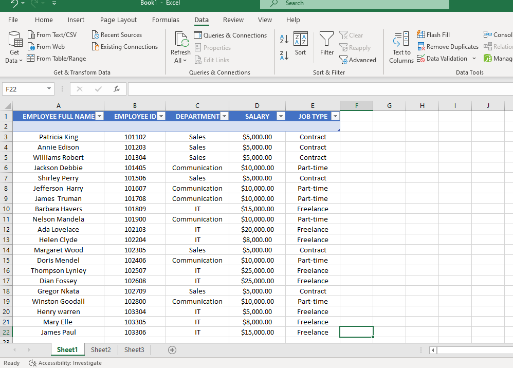
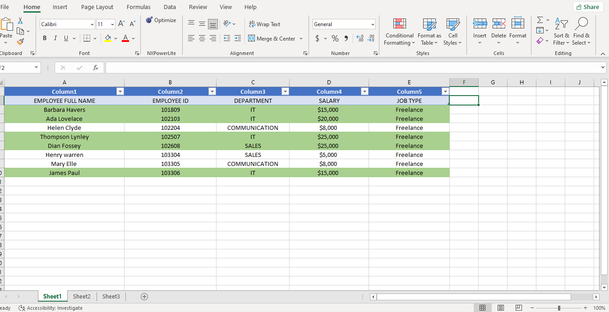
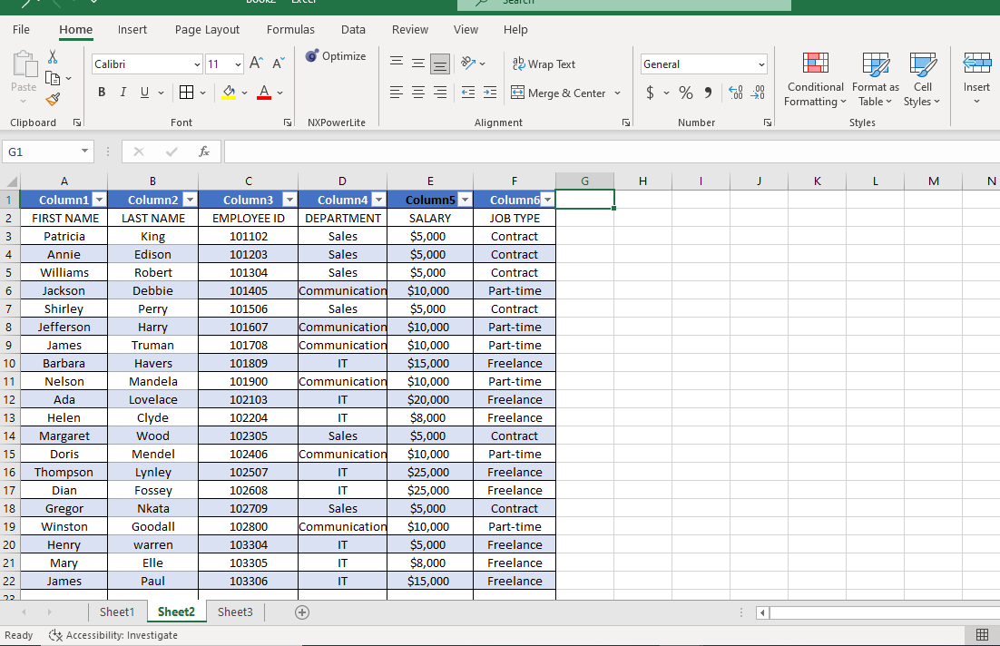
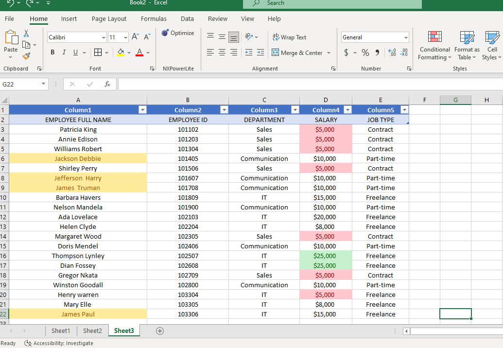

# Data Analysis Training
## Assignment  1
### We were asked to create a worksheet for this task containing 20 rows of information as  _Employee's ID, Employee's full name,Department,Salary,and Job Type._ I designed a table with names that i have come across. I implemented a basic system for generating the employee ID. I also copied and paste table into worksheet 2 and worksheet 3.
 

## Assignment 2
### We were asked to show employee's who are freelancers and we should highlight the ones who's salaries are above $10,000
I selected all the row of employee's who's are Freelencer, copied  from the first **ASSIGNMENT 1** and paste on a new worksheet. I then used Conditional Formatting to highlight all those who salaries are above $10,000 on the Rows.

## On this sheet, we were asked to split employee full names into first name and last name, and check for duplicate and highlight if any.
 I created a column after the employee names, I used the 'text to column'feature on the data of excel. I then selected the employee name column and click on the text to column option, data type delimited was already selected and i went to next option,I selected **comma** and **space** as the delimiters and next, data type was already selected as General and destination column was already selected as current column data on, and i clicked finished and it asked, there's already data here. do you want to replace? I answered yes. first and last name were split into column selected and new column created. I didnt have any duplicate. P.S I had an issue with the highlighted columns and rows as i tried undoing but refused.
 

 ## On this sheet, we were told to highlight employee's who's name begin with the letter E (yellow). format the salary column such that the highest salary has a green background and the lowest salary has a red background.
I didnt have any name that started with letter E so i used names that started with letter J. I selected the employee name column, I clicked on conditional formatting feature, then  highlight cell rules,clicked on text that contain,then i typed in letter J and also formatted the color to be yellow. I also highlighted salary column,clicked on conditional formatting feature,new rules, I selected 'format all cells based on their value' rule type,I edited the rule description to lowest with color red and highest value with color green.

 
